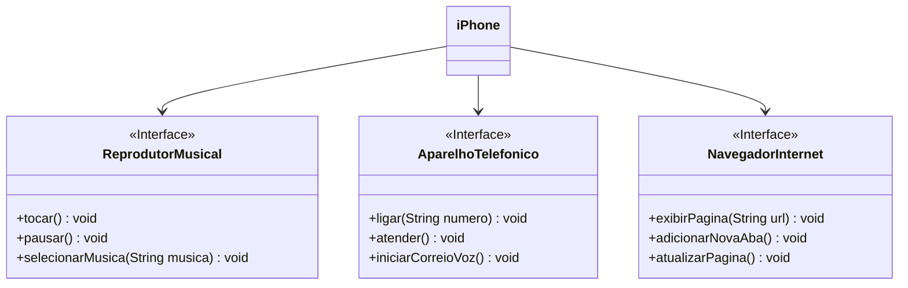

# dio-uml-iphone

## DIO - Trilha Java Básico / Desafio POO (Modelagem e Diagramação de um Componente iPhone)

### Desafio
Neste desafio, vamos modelar e diagramar a representação UML do componente iPhone, abrangendo suas funcionalidades como Reprodutor Musical, Aparelho Telefônico e Navegador na Internet.

### Contexto
Com base no vídeo de lançamento do iPhone de 2007, devemos elaborar a diagramação das classes e interfaces utilizando uma ferramenta UML de sua preferência. Em seguida, implementaremos as classes e interfaces no formato de arquivos ```.java```.

### Funcionalidades a Modelar
1. Reprodutor Musical
    - Métodos: ```tocar()```, ```pausar()```, ```selecionarMusica(String musica)```
2. Aparelho Telefônico
    - Métodos: ```ligar(String numero)```, ```atender()```, ```iniciarCorreioVoz()```
3. Navegador na Internet
    - Métodos: ```exibirPagina(String url)```, ```adicionarNovaAba()```, ```atualizarPagina()```

### Objetivo
1. Criar um diagrama UML que represente as funcionalidades descritas acima.
2. Implementar as classes e interfaces correspondentes em Java (Opcional).

### Diagrama UML (Mermaid)

------------------
Mais detalhes disponíveis no repositório do desafio: [digitalinnovationone/trilha-java-basico](https://github.com/digitalinnovationone/trilha-java-basico/tree/main/desafios/poo)